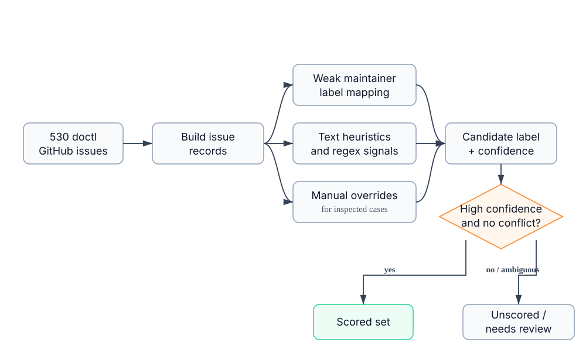
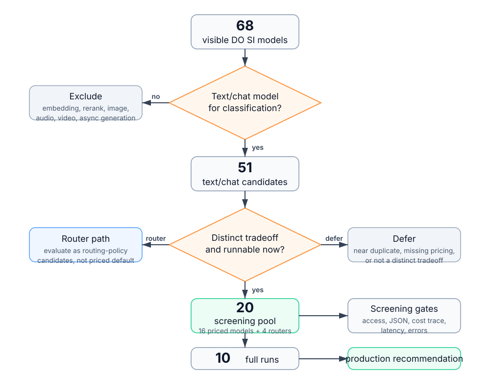
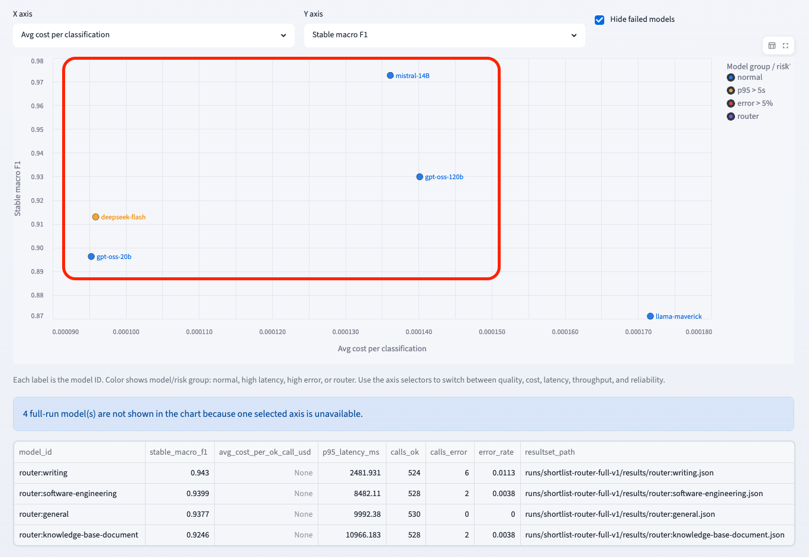
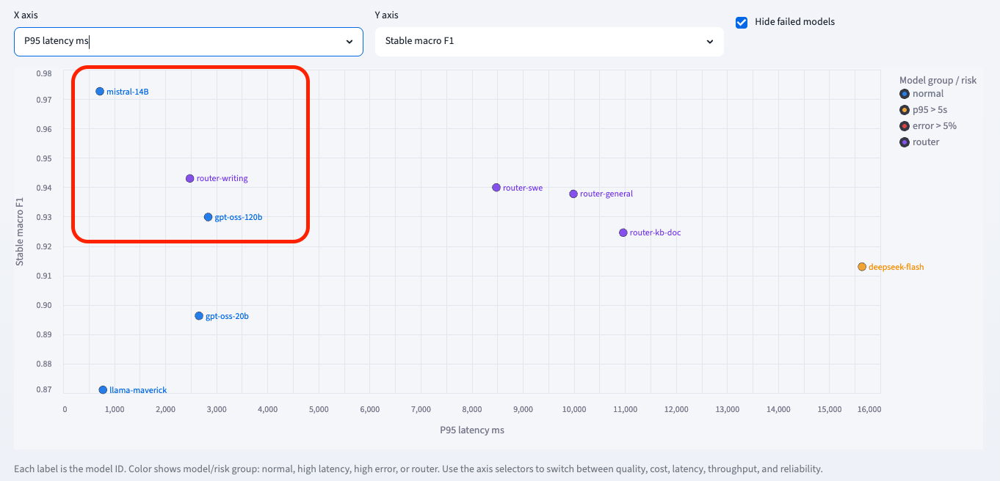

## Issue Classification Model Evaluation

Production recommendation for classifying DigitalOcean `doctl` GitHub issues
with Serverless Inference models.

### 1. Evaluation Objective

The customer concern is cost: the current issue-classification path may be more
expensive than necessary. I evaluated DigitalOcean Serverless Inference models
against the constraints that matter for production use:

| Constraint | Evidence used |
|---|---|
| Classification quality | scored-set accuracy, stable macro F1, per-class recall, confusion matrix |
| Unit economics | average cost per classification, total run cost, token usage |
| API performance | p50/p95 latency, throughput, retry/error behavior |
| Production reliability | parseable JSON output, valid labels, traceable cost, fallback handling |

I treated these as gates, not independent rankings. A cheap model that misses
critical issue types does not solve the customer problem; a high-quality model
with poor latency, flaky output, or missing cost traceability is not ready for
production use.

---

### 2. Ground-Truth Set Construction

The full corpus has 530 issues. I classify every issue, but only issues with a
high-confidence certified label are used for accuracy/F1. This avoids treating
noisy or ambiguous labels as ground truth.

**Dataset split**

| Split | Count | How it is used |
|---|---:|---|
| Scored | 126 | Accuracy, F1, per-class metrics, confusion matrix |
| Unscored | 399 | Distribution, disagreement, qualitative behavior |
| Review | 5 | Known ambiguous cases, excluded from scoring |
| Total | 530 | Every issue is still classified by each evaluated model |

**Scored label support**

| Label | Support |
|---|---:|
| bug | 35 |
| enhancement | 35 |
| security | 26 |
| question | 18 |
| documentation | 10 |
| other | 2 |

**Ground-truth construction**

- Start with maintainer labels as weak signals, not authoritative labels.
- Map only high-signal maintainer labels into the six target categories.
- Add deterministic text signals from issue title/body, such as CVE/security,
  docs/help text, bug/error language, and feature-request language.
- Apply manual overrides where inspection shows a clear schema mismatch.
- Keep conflicting, ambiguous, or low-information issues out of the scored set.

**Confidence scoring**

Each issue receives a candidate label and a transparent confidence score based
on the evidence above. A row enters the scored set only when the confidence is
high enough and there is no conflict signal. Otherwise it stays in `unscored` or
`review`.

This makes the scored set smaller, but each accuracy claim is tied to labels
with recorded evidence. The remaining corpus is still useful for distribution,
agreement, and qualitative behavior analysis, but not for accuracy claims.

---

### 3. Dataset Construction

Every certified label has a recorded source and rationale, so disputed cases can
be checked directly.

---

### 4. Model Inventory

I first removed models that cannot serve this task at all, then spent evaluation
budget on a representative text/chat shortlist.

**Current snapshot**

| Stage | Count | Decision type |
|---|---:|---|
| Visible through DO SI `/v1/models` | 68 | Key-scoped inventory snapshot |
| Text/chat-capable candidates | 51 | Hard capability/modality filter |
| Curated screening pool | 20 | Tradeoff-representative shortlist |
| Models with full 530-issue resultsets | 10 | Final empirical comparison set |

**Hard filter from 68 to 51**

This first pass is not judging model quality. It only removes models that do
not fit the interface or modality needed for issue classification:

- embeddings
- rerankers
- image models
- audio / speech / TTS models
- video models
- async image/video generation models

The remaining 51 models are the empirical model universe for this assignment.
The shortlist samples that universe across cost-efficient, balanced, larger,
reference, reasoning, and router-style candidates.

The 51-to-20 step is not a quality cut. It selects models that are distinct
enough to teach me something in screening: 16 priced single-model candidates
plus 4 router candidates. Near-duplicates, missing-pricing models, and models
without a clear additional tradeoff are deferred rather than rejected.

---

### 5. Model Selection Funnel

The broad inventory stays visible, but full-corpus runs are reserved for models
that are plausible production candidates.

---

### 6. Initial Model Screening

The screening run checked whether each shortlisted model could be called,
parsed, priced, and operated reliably enough for a full 530-issue run.

**Screening gates**

- Can the configured DO SI key call the model?
- Does the model spend too many tokens reasoning and fail to return the final
  label JSON?
- Can I calculate cost from returned token usage and local pricing metadata?
- Does it avoid systematic empty, truncated, or invalid JSON output?
- Is p95 latency low enough to finish a full run in a reasonable time?
- Are failures explicit enough to retry, route, or exclude?

**Examples of screening outcomes**

| Outcome | Examples | Decision |
|---|---|---|
| Auth / permission failures | some OpenAI/Anthropic reference models | Exclude until key access changes |
| Systematic output-contract failure | models returning empty/truncated JSON under initial settings | Fix prompt/max tokens, then retest |
| Too slow for review timeline | several large/reasoning models | Defer from full-run comparison |

This step removed models with obvious operational problems before spending time
and API budget on full-corpus runs.

---

### 7. Full-Corpus Results

The final comparison uses full 530-issue resultsets and production metrics.

**Full-run models currently available**

| Model | Stable macro F1 | Avg. classification cost | P95 latency | OK / Total |
|---|---:|---:|---:|---:|
| mistral-3-14B | 0.9726 | $0.000136 | 719ms | 530 / 530 |
| router:writing | 0.9430 | N/A | 2482ms | 524 / 530 |
| router:software-engineering | 0.9399 | N/A | 8482ms | 528 / 530 |
| router:general | 0.9377 | N/A | 9992ms | 530 / 530 |
| openai-gpt-oss-120b | 0.9299 | $0.000140 | 2840ms | 529 / 530 |
| router:knowledge-base-document | 0.9246 | N/A | 10966ms | 528 / 530 |
| deepseek-4-flash | 0.9130 | $0.000096 | 15642ms | 530 / 530 |
| openai-gpt-oss-20b | 0.8963 | $0.000095 | 2660ms | 524 / 530 |
| llama-4-maverick | 0.8711 | $0.000172 | 780ms | 526 / 530 |

Average classification cost is calculated from completed calls with returned
token usage. `N/A` means the run did not return billable usage, usually because
the model could not be called successfully.

---

### 8. Quality vs Cost

Average cost per classification is the cost metric I use for production
planning because every issue produces one independent model call.

The cheapest average call is not necessarily the best production default.
`mistral-3-14B` costs modestly more per classification than `gpt-oss-20b`, but
the quality gain is material.

**Observed pattern**

- `openai-gpt-oss-20b` is cheaper but meaningfully lower quality.
- `openai-gpt-oss-120b` is not better than `mistral-3-14B` despite similar cost.
- `llama-4-maverick` is dominated: higher cost and lower quality.
- Router models are not plotted on cost axes until router pricing is confirmed.

---

### 9. Quality vs Latency

For production, the best point is high quality with low p95 latency.

`mistral-3-14B` gives the best quality/latency tradeoff in the current full
runs: highest stable macro F1 and sub-second p95 latency.

**Observed pattern**

- `mistral-3-14B` is closest to the high-quality / low-latency corner.
- Router models have strong quality, but most have much higher p95 latency.
- `deepseek-4-flash` has acceptable quality/cost but p95 latency is too high for
  a default production path.

---

### 10. Recommendation

Recommend a high/low production pair:

- high-quality default: `mistral-3-14B`
- low-cost constrained path: `openai-gpt-oss-20b`

**Evidence**

The full-corpus runs support `mistral-3-14B` as the default:

- highest stable macro F1 among full-run models: 0.9726
- 530 / 530 successful calls in the selected full run
- p95 latency around 719ms
- cost is not the cheapest, but remains modest for the quality gain
- strong operational profile relative to larger or slower candidates

`openai-gpt-oss-20b` is not the best model overall, but it is materially cheaper
and gives a useful low-cost comparison point. I would only use it where the
business risk is low enough to accept lower quality.

**Production roles**

| Role | Model | Rationale |
|---|---|---|
| Default path | `mistral-3-14B` | Best quality/latency tradeoff with known pricing |
| Low-cost path | `openai-gpt-oss-20b` | Lower average classification cost, but lower F1 and higher p95 |
| Future routing candidate | `router:writing` | Strong result, but pricing is not confirmed enough for the final costed pair |

This addresses the requested two-model tradeoff without pretending the cheaper
model is a universal fallback. `openai-gpt-oss-20b` is a cost-control option for
low-risk traffic. For timeouts, invalid output, security-sensitive issues, or
ambiguous bug/security cases, the safer fallback is retry, route to a stronger
policy candidate, or human review.

---

### 11. Production Handling

The production setup should keep the normal path simple: call `mistral-3-14B`
for every issue, and use the backup model only when it has a clear operational
purpose.

**When to use the backup model**

1. API failure on the default model: for timeout, rate limit, or retryable
   provider error, retry `mistral-3-14B` with exponential backoff 1-2 times. If
   it still fails, call `openai-gpt-oss-20b` and mark the result as
   fallback-produced.
2. Output contract failure: for empty output, invalid JSON, or invalid label,
   retry once with a stricter prompt. If the default still fails the contract,
   call `openai-gpt-oss-20b`. If the backup also fails, route the issue to
   manual review.
3. Online monitoring: run `openai-gpt-oss-20b` on a small sample of successful
   production requests. Track disagreement rate and disagreement by label. If
   the disagreement rate moves materially away from the baseline, review the
   sampled cases before changing the model choice or routing policy.

This makes the second model useful without pretending it is equally safe as the
default. It is an operational fallback and monitoring signal, not a blanket
replacement for the stronger model.

---

### 12. Closing Summary

**What the tradeoff screen showed**

- Small/cheap did not automatically win: `openai-gpt-oss-20b` and
  `deepseek-4-flash` were cheaper, but both gave up too much quality or latency
  for the default path.
- Larger did not automatically win: `openai-gpt-oss-120b` was stronger than the
  20B model, but still below `mistral-3-14B` while costing about the same.
- Reasoning/thinking behavior was not helpful for this strict classification
  task. Several models spent too many tokens reasoning, increased latency/cost,
  or needed larger output budgets just to return the final JSON.
- Coding/routing-style candidates were worth testing. `router:writing` looked
  promising on quality, but router pricing and attribution are not clean enough
  for the final costed pair yet.

**Final position**

The recommended high/low pair is:

- `mistral-3-14B` as the high-quality production default.
- `openai-gpt-oss-20b` as the low-cost constrained path for traffic that passes
  explicit safety/ambiguity checks.

This is not a simple "model A primary, model B fallback" recommendation. The
production wrapper should retry transient failures, avoid cheap fallback for
security or ambiguous bug/security cases, and route high-risk ambiguity to a
stronger policy candidate or human review.

**Open follow-up**

Some OpenAI and Claude small models were visible in the inventory but failed
under the current DO SI access/subscription path. If those access issues are
resolved, they should be rerun through the same harness before treating this as
a final provider-wide conclusion.
